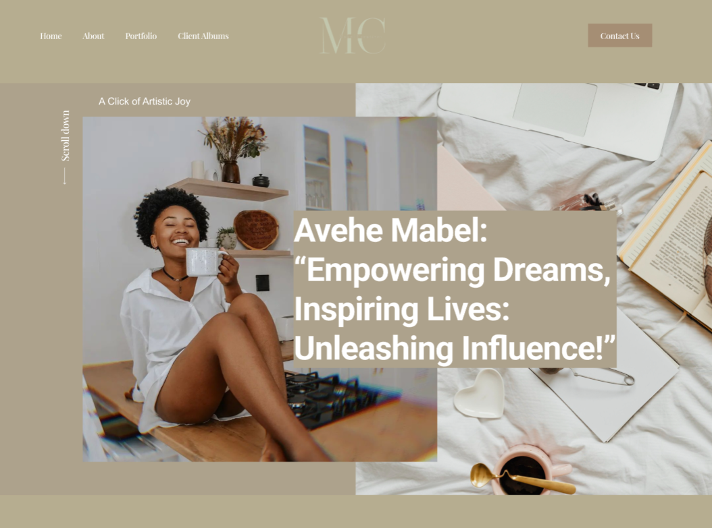

Click [here](https://www.figma.com/file/cF4vNUjU2FAasYeFWjEk0K/Mabel?type=design&node-id=5%3A33&mode=design&t=jfltSFHrySwQui1i-1) to open the Figma design for this project:
 
 

## Table of Contents
- [Overview](#overview)
- [Figma Design](#figma-design)
- [Screenshots](#screenshots)
- [Project Description](#project-description)
- [Installation](#installation)
- [Usage](#usage)
- [Contributions](#contributions)
- [License](#license)

## Overview

Mabel Creatives was a unique design project where I was handed the reins to craft a web design from the ground up. Initially, no implementation had taken place, but I was provided with a color palette and tasked with conducting research on the client to create a design that perfectly aligned with their style and brand identity.

After thorough research and a collaborative meeting with the client, I presented them with the design, and I'm delighted to say that they were thoroughly impressed with the results. This project showcases not just my design skills, but also my ability to understand a client's vision and translate it into a visually captivating web solution.

The design embodies my commitment to creating web experiences that resonate with the client's goals and leave a lasting impression on their audiences. Through this project, I demonstrated my capacity to turn a creative vision into a reality, ensuring both client satisfaction and an exceptional user experience.

## Figma Design

)
- [Link to Figma Design](https://www.figma.com/file/cF4vNUjU2FAasYeFWjEk0K/Mabel?type=design&node-id=0%3A1&mode=design&t=jfltSFHrySwQui1i-1)
)

Include a link to the Figma design, a preview image, and the direct link to the Figma file (if you have it available).

## Screenshots
Include screenshots of the project to provide a visual representation.

## Project Description
Write a detailed project description. Explain your role in the project, the technologies used, challenges faced, and the outcomes achieved.

## Installation
If applicable, provide instructions on how to install or set up the project locally.

## Usage
Explain how to use the project or interact with it. Include any specific user instructions if needed.

## Contributions
Mention contributions from other collaborators or team members, if any.

## License
This project is licensed under the [License Name](License_URL) - see the [LICENSE.md](LICENSE.md) file for details.

[Optional: Add a note on permissions, if required by your organization or client]

